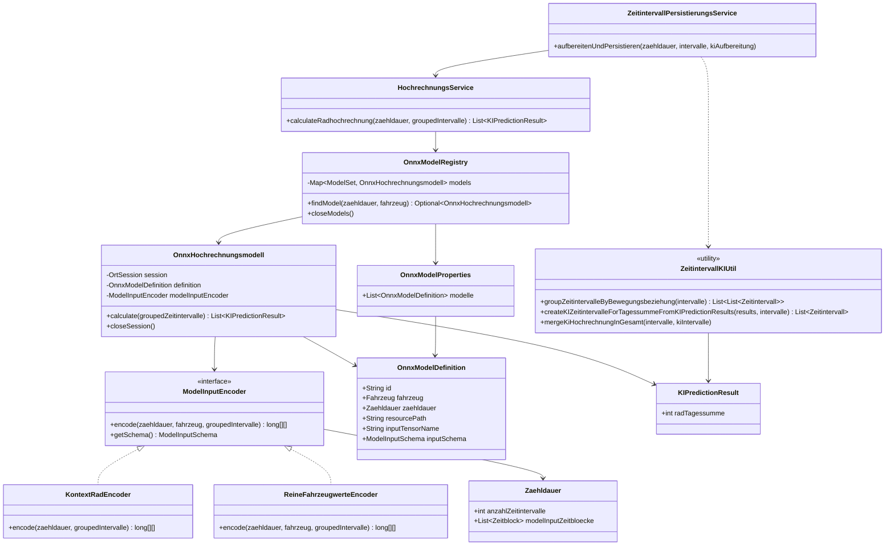

# Dokumentation: Erweiterung KI-Hochrechnung Radverkehr fuer 13h und 16h

## Ziel und Umfang

Die bestehende Radverkehrshochrechnung fuer 2x4h-Zaehlungen wird so modularisiert, dass fuer jede Zaehlungsdauer ein eigenes ONNX-Modell verwendet werden kann. In Teil 1 werden drei Radmodelle unterstuetzt:

| Zaehlungsdauer | Modell          | Eingabe pro Bewegungsbeziehung |
| --- |-----------------| --- |
| `DAUER_2_X_4_STUNDEN` | `RAD_2x4h.onnx` | Bestehendes Schema mit Radwert und Kalendermerkmalen fuer 32 Intervalle |
| `DAUER_13_STUNDEN` | `RAD_13h.onnx`  | 52 reine Radzaehlwerte in zeitlicher Reihenfolge |
| `DAUER_16_STUNDEN` | `RAD_16h.onnx`  | 64 reine Radzaehlwerte in zeitlicher Reihenfolge |

Teil 1 veraendert weder die vorhandenen Hochrechnungswerte fuer Kfz, SV und GV noch fuegt er neue Fahrzeugtypen als Hochrechnungswerte hinzu. Diese Erweiterung ist Teil 2 und wird erst nach Abschluss von Teil 1 optional nach Absprache mit dem Fachbereich umgesetzt.

## Fachliche Festlegungen

- Die neuen 13h- und 16h-Modelle erhalten ausschliesslich die erfassten Radwerte; Kalendermerkmale werden nicht uebergeben.
- Die Eingabereihenfolge ist zeitlich aufsteigend anhand des bestehenden `sortingIndex`.
- Die ONNX-Modelle verwenden den Eingabetensornamen `int64_input` und den Datentyp `int64`.
- Die Ausgabe bleibt `long[anzahlBewegungsbeziehungen][1]`. Der einzelne Wert je Bewegungsbeziehung ist die vorhergesagte Rad-Tagessumme.
- Die Zeitfenster und die erwartete Zahl der Viertelstundenintervalle werden ausschliesslich aus `Zaehldauer` abgeleitet. Sie werden nicht nochmals pro Modell konfiguriert.
- Fehlende, nicht lesbare oder inkompatible Modelle verhindern den Anwendungsstart nicht. Die betroffene Zaehlung wird ohne KI-Radhochrechnung verarbeitet; der Fehler wird mit Modell-ID und Zaehlungs-ID protokolliert.
- Bestehende abgeschlossene Zaehlungen werden nicht nachberechnet. Die neuen Modelle gelten fuer kuenftige Aufbereitungen.

## Bestehende Grundlage

`ZeitintervallZeitblockSummationUtil` bildet Zaehlungsdauern bereits auf Zeitbloecke ab:

| Zaehlungsdauer | Zeitfenster fuer die Modelleinabe | Bestehende Definition |
| --- | --- | --- |
| 2x4h | 06:00-10:00 und 15:00-19:00 | `ZB_06_10`, `ZB_15_19` |
| 13h | 06:00-19:00 | `ZB_06_19` |
| 16h | 06:00-22:00 | `ZB_06_22` |

Die bestehende Methode `getZeitbloeckeAccordingZaehldauer` ist nicht direkt als Modelleingabe geeignet, weil sie neben den Erhebungsfenstern auch Stunden-, Halbstunden- und Tagesaggregate liefert. Eine neue, gezielt benannte Methode soll nur die urspruenglichen Erhebungsfenster liefern.

Die aktuelle Implementierung in `KIService` ist auf das bisherige 2x4h-Radmodell zugeschnitten: Sie filtert die zwei Spitzenzeitfenster fest, mappt jedes Intervall auf zehn Merkmale und erwartet daher 32 mal zehn Eingabewerte. Diese Kopplung wird aufgeloest.

## Zielarchitektur



## Modellkonfiguration

Die Konfiguration ersetzt den einzelnen Property-Wert `dave.onnx.model-path` durch eine Liste von Modellen. Die Konfiguration beschreibt nur Modellauswahl und technische ONNX-Informationen. Zeitfenster und Intervallzahl werden aus `Zaehldauer` bestimmt.

```yaml
dave:
  prediction:
    models:
      - id: rad-2x4h-v1
        fahrzeug: RAD
        zaehldauer: DAUER_2_X_4_STUNDEN
        resource-path: model/RAD_2x4h.onnx
        input-tensor-name: int64_input
        input-schema: REINE_FAHRZEUGWERTE

      - id: rad-13h-v1
        fahrzeug: RAD
        zaehldauer: DAUER_13_STUNDEN
        resource-path: model/RAD_13h.onnx
        input-tensor-name: int64_input
        input-schema: REINE_FAHRZEUGWERTE

      - id: rad-16h-v1
        fahrzeug: RAD
        zaehldauer: DAUER_16_STUNDEN
        resource-path: model/RAD_16h.onnx
        input-tensor-name: int64_input
        input-schema: REINE_FAHRZEUGWERTE
```

`input-schema` ist bewusst kein Boolean. `REINE_FAHRZEUGWERTE` verwendet das bestehende Enum `Fahrzeug`, um den passenden Zaehlwert aus dem Zeitintervall zu lesen. Neue Tensorformate werden durch einen eigenen `ModelInputEncoder` ergaenzt. Damit kann ein kuenftiges Modell beispielsweise weitere Merkmale nutzen, ohne die ONNX-Laufzeit oder die Modellselektion anzupassen.

`OnnxHochrechnungsmodell` bildet die technische ONNX-Laufzeit ab. Da alle konfigurierten Modelle ONNX-Artefakte sind, verwendet die Registry direkt diesen Typ. Der `HochrechnungsService` und die Registry bleiben in Unit-Tests durch Mockito testbar, ohne ein ONNX-Artefakt zu laden.

Die Konfiguration der beiden neuen Modelle ist bereits vorhanden. Bis die Artefakte unter den konfigurierten Pfaden bereitgestellt werden, markiert die `OnnxModelRegistry` sie als nicht verfuegbar. Zaehlungen dieser Dauer werden dann ohne KI-Radhochrechnung persistiert.

## Umsetzung Teil 1

1. Modelle ablegen und konfigurieren.

   Die Artefakte `RAD_2x4h.onnx`, `RAD_13h.onnx` und `RAD_16h.onnx` werden unter `src/main/resources/models/` abgelegt. `application.yml` erhaelt die beschriebene Modellliste. Eine `@ConfigurationProperties`-Klasse validiert eindeutige Modell-IDs sowie die Kombination aus Zielgroesse und Zaehlungsdauer.

2. Zaehlungsdauerbasierte Eingabezeitfenster zentralisieren.

   Die Methode `Zaehldauer#modelInputZeitbloecke()` liefert genau die Erhebungsfenster. Sie gibt fuer 2x4h `ZB_06_10` und `ZB_15_19`, fuer 13h `ZB_06_19` und fuer 16h `ZB_06_22` zurueck. Die erwartete Intervallzahl wird aus `Zaehldauer#getAnzahlZeitintervalle()` bezogen.

3. Eingabe-Encoder einfuehren.

   `ModelInputEncoder` selektiert die Intervalle mit den zentralen Zeitfenstern, sortiert sie aufsteigend nach `sortingIndex`, prueft die erwartete Anzahl und erstellt den `long[][]`-Tensorinhalt. `KontextRadEncoder` kapselt die bestehende Logik mit `KIZeitintervallMapper`. `ReineFahrzeugwerteEncoder` liest anhand von `Fahrzeug` den passenden Zaehlwert aus dem `Zeitintervall` und erzeugt eine Zeile mit 32, 52 beziehungsweise 64 Werten je Bewegungsbeziehung.

4. ONNX-Laufzeit modularisieren.

    Die technische Session-Verwaltung aus `KIService` wird nach `OnnxHochrechnungsmodell` ueberfuehrt. Ein Modell besitzt eine eigene ONNX-Session. Die `OnnxModelRegistry` initialisiert alle konfigurierten Modelle und markiert bei einem Initialisierungsfehler nur das betroffene Modell als nicht verfuegbar. Der Start der Anwendung bleibt moeglich.

5. Modellselektion und Orchestrierung einfuehren.

   `HochrechnungsService` ermittelt ueber `OnnxModelRegistry` die aktiven Modelle fuer die Zaehlungsdauer, gruppiert die Zeitintervalle nach Bewegungsbeziehung und fuehrt die Modelle aus. In Teil 1 existiert jeweils hoechstens ein Radmodell pro Zaehlungsdauer. Das Design erlaubt dennoch mehrere, nicht ueberlappende Zielgroessen.

6. Ergebnisverarbeitung aus `ZeitintervallKIUtil` herausloesen.

   Die ONNX-Ausgabe wird zunaechst weiterhin als `KIPredictionResult` verarbeitet. `ZeitintervallKIUtil` erzeugt je Bewegungsbeziehung das bestehende `GESAMT_KI`-Intervall, setzt `fahrradfahrer` sowie `hochrechnung.hochrechnungRad` und uebertraegt den Wert in das regulare `GESAMT`-Intervall. Das heutige fachliche Ergebnis bleibt dadurch kompatibel.

7. Persistierungsservice anbinden.

   `ZeitintervallPersistierungsService` ruft statt `KIService` direkt den `HochrechnungsService` auf. Die bisherige feste Aktivierung fuer 2x4h, 13h und 16h wird durch die Verfuegbarkeit eines passenden Modells in der Registry ersetzt. Bei Inferenzfehlern wird die konventionelle Aufbereitung weiterhin gespeichert.

8. Fehlerbehandlung und Protokollierung

   Fehlermeldungen enthalten Modell-ID und Ursache. Ein Fehler bei der Inferenz darf weder ein anderes Modell noch die restliche Aufbereitung beeinflussen. Nicht verfuegbare Modelle werden beim Start und bei der Verwendung klar geloggt.

9. Tests

   Die Encoder-, Modellselektions-, Fehler- und Persistenzpfade fuer 2x4h, 13h und 16h sind getestet. Echte ONNX-Integrationstests mit den bereitgestellten kleinen Testartefakten pruefen fuer beide Dauern die Inferenz bis zur Persistierung des `GESAMT_KI`- und `GESAMT`-Werts.

## Teil 2: Hochrechnung einzelner Fahrzeugtypen

Teil 2 erweitert die Ergebniswerte um Pkw, Lkw, Lastzuege, Busse und Kraftraeder. Dieser Teil ist bewusst nicht Bestandteil der aktuellen Umsetzung.

### Ziel

`Hochrechnung` wird um diese Felder erweitert:

```java
private BigDecimal hochrechnungPkw;
private BigDecimal hochrechnungLkw;
private BigDecimal hochrechnungLastzuege;
private BigDecimal hochrechnungBusse;
private BigDecimal hochrechnungKraftraeder;
```

Kfz, SV und GV sollen danach nicht zusaetzlich und unabhaengig vorhergesagt werden, sondern aus den hochgerechneten Fahrzeugtypen abgeleitet werden:

```text
GV  = Lkw + Lastzuege
SV  = Lkw + Lastzuege + Busse
Kfz = Pkw + Lkw + Lastzuege + Busse + Kraftraeder
```

### Vorbereitete Erweiterungspunkte

- Ein Ergebnisobjekt wie `Hochrechnungswerte` kann um die fuenf Fahrzeugtypen erweitert werden.
- Ein neues Modell kann einen eigenen `ModelInputEncoder` erhalten, falls sein Eingabeformat vom bisherigen Schema abweicht (bisher aber nicht geplant).
- Die Ergebnisverarbeitung wird aus `ZeitintervallKIUtil` in einen eigenen Service ueberfuehrt und fasst dann mehrere Modelle je Bewegungsbeziehung zusammen, bevor ein einziges fachliches `GESAMT_KI`-Intervall persistiert wird.
- Eine separate Herkunfts- und Ergebnistabelle sollte Modell-ID, Modellversion, Zielgroesse, Bewegungsbeziehung, Zeitpunkt und Ergebniswert speichern. Damit bleibt nachvollziehbar, welches Modell welchen Teilwert beigesteuert hat.
- Eine Flyway-Migration erweitert die Datenbankspalten fuer die neuen Hochrechnungswerte.
- `LadeZaehldatumTageswertDTO` und `LadeZaehldatenService` muessen die neuen Tageswerte an die API ausliefern. Das Frontend muss Tabellen, Diagramme und Exporte entsprechend erweitern.

Ohne eigene Fahrzeugtypmodelle duerfen die Typwerte nicht aus einem Gesamt-Kfz-Wert mit impliziten Anteilen abgeleitet werden. Das waere eine weitere fachliche Schaetzung und erfordert explizit definierte, belastbare Verteilungsfaktoren.
